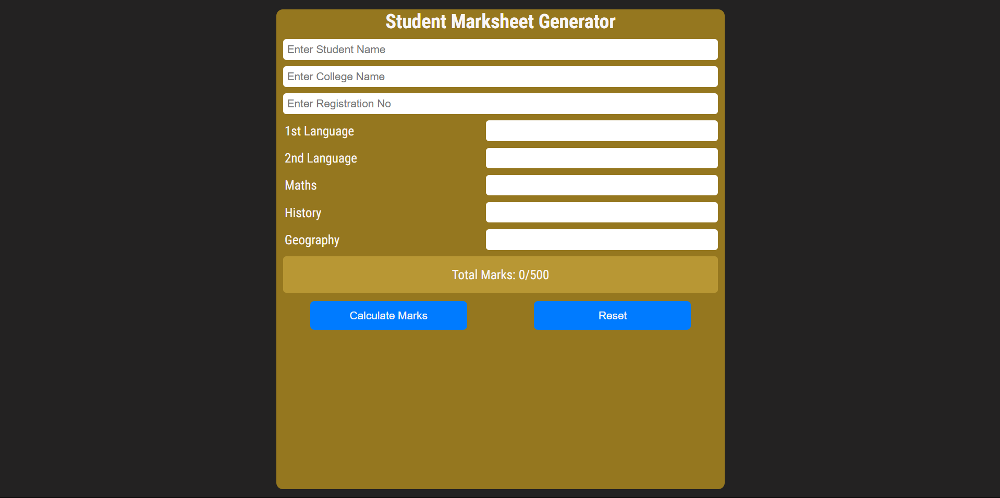
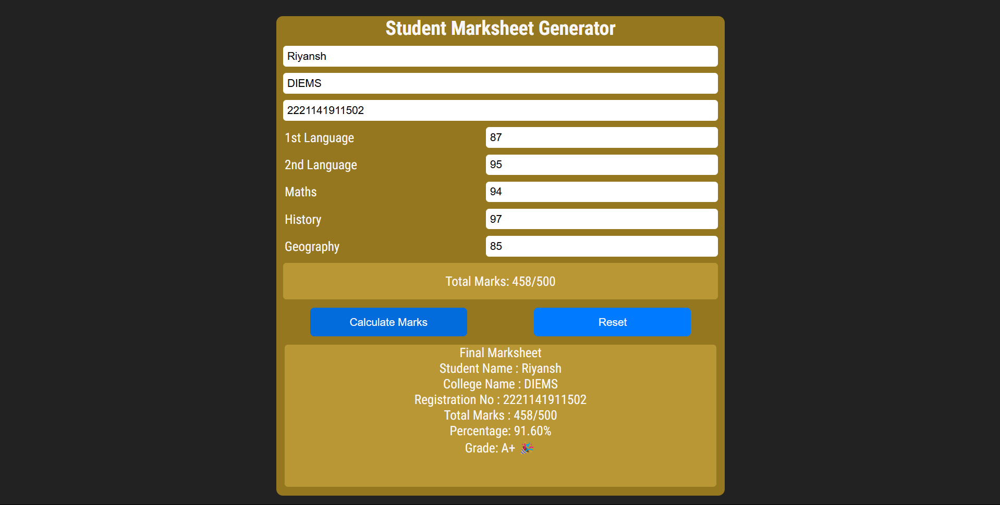

# Student Marks Calculator

## 📌 Overview
This project is a simple **Student Marks Calculator** that takes input for marks in different subjects, calculates the total marks, percentage, and assigns a grade based on the obtained percentage. The application dynamically updates results and allows resetting inputs.

## ✨ Features
- ✅ Input student details (Name, College, Registration No.)
- ✅ Enter marks for multiple subjects
- ✅ Dynamic total marks calculation
- ✅ Percentage calculation
- ✅ Grade assignment based on percentage
- ✅ Reset functionality to clear inputs and results

## 🛠️ Technologies Used
- HTML
- CSS
- JavaScript (Vanilla JS for DOM manipulation)

## 📂 Project Structure
```
├── index.html      # Main HTML file
├── styles.css      # Styling for the project
├── script.js       # JavaScript logic for marks calculation
├── README.md       # Documentation (this file)
```

### 1️⃣ Project Structure


### 2️⃣ Resulting Marksheet


## 🚀 Usage
1. Clone the repository:
   ```sh
   git clone https://github.com/Shailesh2003-arch/student-marks-calculator.git
   ```
2. Open `index.html` in a browser.
3. Enter student details and marks.
4. Click on **Calculate Marks** to generate the result.
5. Click **Reset** to clear inputs and results.

## 🎯 Grading System
| Percentage | Grade |
|------------|--------|
| 90% and above | A+ 🎉 |
| 80% - 89.99% | A |
| 70% - 79.99% | B |
| 60% - 69.99% | C |
| 50% - 59.99% | D |
| Below 50% | Fail ❌ |

## 🤝 Contribution
1. Fork the repository.
2. Create a new branch: `git checkout -b feature-branch`
3. Commit changes: `git commit -m "Added new feature"`
4. Push to branch: `git push origin feature-branch`
5. Submit a pull request.

## 📜 License
This project is **open-source** and available under the **MIT License**.
